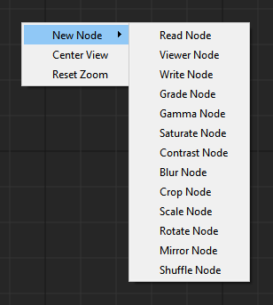
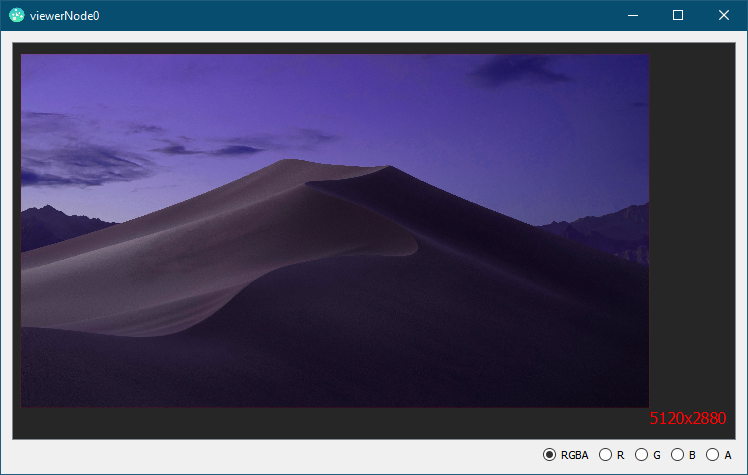

#  Image-Editor

# Introduction
This is a node-based compositing image editor which represents an entire composite as a directed unweighted graph, linking media objects and effects in a procedural map, intuitively laying out the progression from source input to final output. This type of compositing interface allows great flexibility, including the ability to modify parameters of an earlier image processing step while viewing the final composite.

[Report](https://drive.google.com/file/d/1fHUksRQJrsF-O1jVAyn6bL8wF14P6lcK/view?usp=sharing)
# Tools Used
- **Qt C++:** Qt is a free and open-source widget toolkit for creating graphical user interfaces as well as cross-platform applications that run on various software and hardware platforms such as Linux, Windows, macOS, Android or embedded systems with little or no change in the underlying codebase while still being a native application with native capabilities and speed.

# Download
You can download the latest installable version of [Image-Editor](https://github.com/abansal755/Image-Editor/releases) available for Windows, macOS and Linux.

# Usage
* Once you have downloaded a version, extract the zip file and run Image-Editor.
* Now right click on the empty canvas and go to 'New Node' menu to create that type of node.
    
* Once the nodes are created, right click on each node's connector (a small white box) to connect the input and output of various nodes sequentially. Right-click for creating edges, middle button for deleting edges. In the middle of connecting the 2nd node, press right-click on the canvas to cancel the connection.
* Right-click on each node for properties of each node namely properties window and deleting the node.

# Nodes 
* **Read node:** Reads the image file from your system.
* **View node:** Provides a viewer window to view the image stream. The viewer windows also gives the ability to view the individual color channels.

* **Write node:** To save the modified image with desired quality factor.

#### All the other nodes are image transfrormation nodes. 

* **Grade node:** Used to define the blackpoints and whitepoints of the image.
* **Gamma node:** Applies a constant gamma value to the image. This affects the mid-tones of the image.
* **Saturate node:** Alters the intensity or purity of a color as displayed in an image. The higher the saturation of a color, the more vivid and intense it is. The lower a color's saturation, the closer it is to pure gray on the grayscale.
* **Contrast node:** To alter the difference in brightness between objects or regions. High contrast photos pop out, show textures in the subject and give a feeling of edginess, high energy and strength.
* **Blur node**: Adds box blur to the image with the specified radius.
* **Crop node:** Crops the image to the specified co-ordinates.
* **Scale node:** Scales the image to the specified resolution.
* **Rotate node:** Rotates the image with the specified angle in degrees.
* **Mirror node:** Mirrors the image across horizontal as well as vertical axis
* **Shuffle node:** Shuffle node rearranges different color channels of the image into other color channels.

# References
* [Complete Documentation](https://doc.qt.io/)

# Contributing
 First of all, thanks for thinking of contributing to this project:smiley:.
 Before sending a Pull Request, please make sure that you're assigned the task on a GitHub issue.
* If a relevant issue already exists, discuss on the issue and get it assigned to yourself on GitHub.
* If no relevant issue exists, open a new issue and get it assigned to yourself on GitHub.
 Please proceed with a Pull Request only after you're assigned. It'd be sad if your Pull Request (and your hardwork) isn't accepted just because it isn't ideologically compatible.

 # Getting Started 
* [Download Qt Creator](https://www.qt.io/download)
* Fork this repository.
* Clone the forked repository to your PC.

    `git clone https://github.com/YOUR-USERNAME/Image-Editor`
* Create a branch specific to the issue or feature you are working on.
   
   `git branch <new-branch>`  
    `git checkout <new-branch>`
* Push your work to that branch.

    `git add .`  
    `git commit -m "message"`  
    `git push`
* Create Pull Request.
